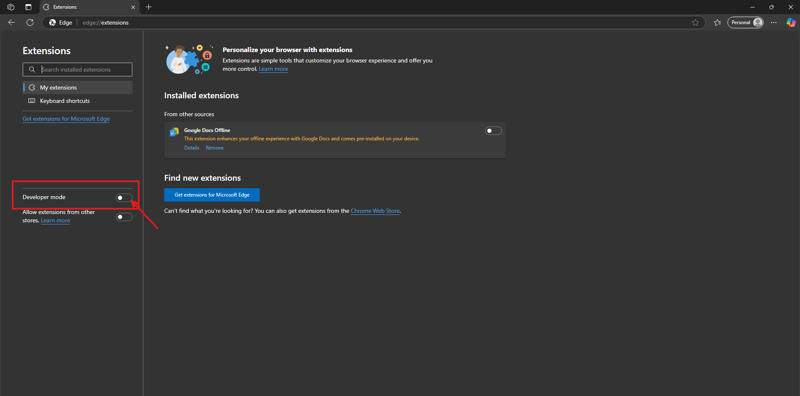
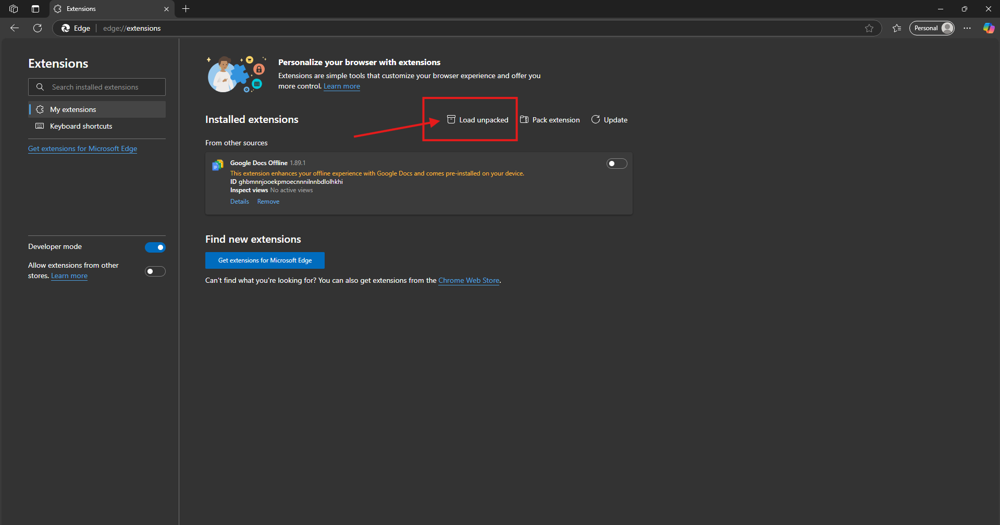
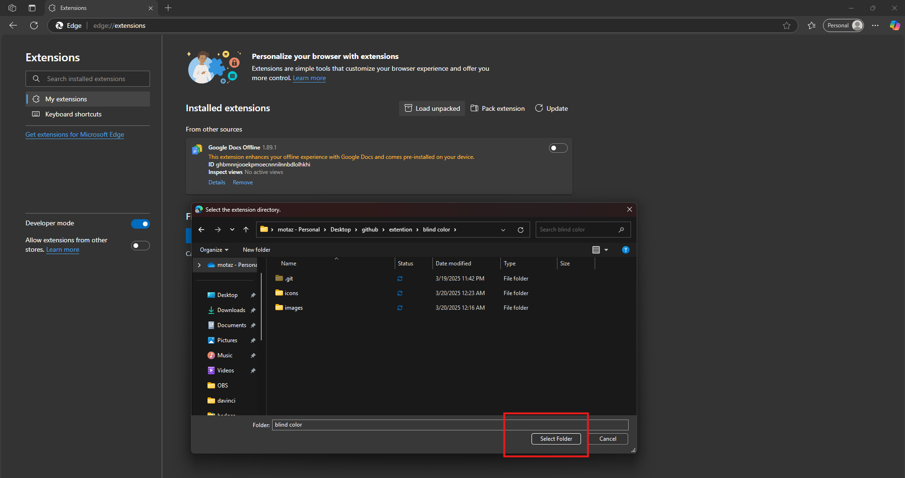
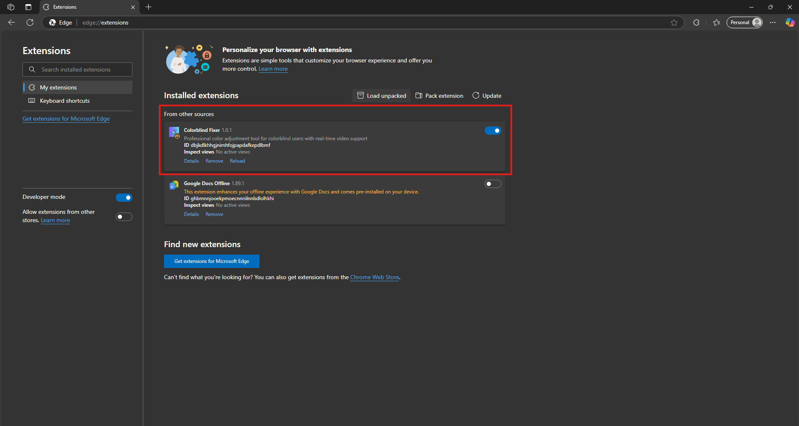
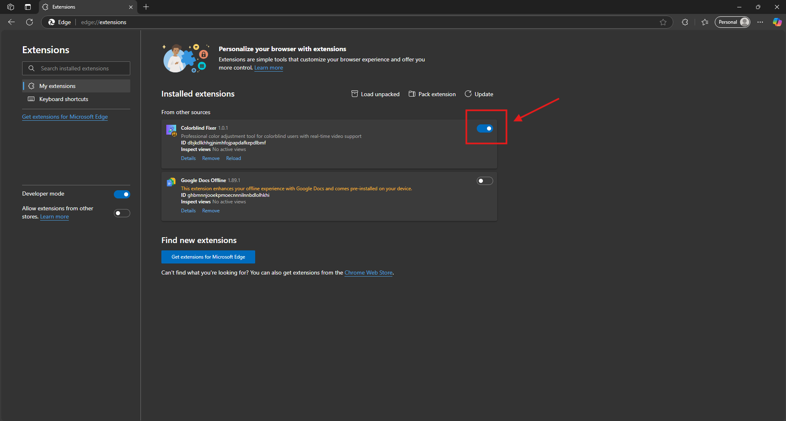

# Colorblind Fixer - مصحح عمى الألوان

## Installation Guide - دليل التثبيت

### English Instructions

1. Download the extension files
2. Open Chrome/Edge browser and navigate to extensions page:
   - Chrome: `chrome://extensions/`
   - Edge: `edge://extensions/`
   
3. Enable "Developer mode" in the top right corner
   

4. Click "Load unpacked" button
   
  

5. Select the extension folder that contains the manifest.json file 

6. The extension icon should appear in your browser toolbar
   

### Disabling the Extension
1. Right-click on the extension icon in the toolbar
2. Select "Manage Extension" from the menu
3. Toggle the switch to disable/enable the extension
   

### التعليمات باللغة العربية

1. قم بتحميل ملفات الإضافة
2. افتح متصفح كروم/ايدج وانتقل إلى صفحة الإضافات:
   - كروم: `chrome://extensions/`
   - ايدج: `edge://extensions/`

3. قم بتفعيل "وضع المطور" في الزاوية العلوية اليمنى
   

4. انقر على زر "تحميل غير مضغوط"
   

5. اختر مجلد الإضافة الذي يحتوي على ملف manifest.json
6. يجب أن يظهر رمز الإضافة في شريط أدوات المتصفح
   

### تعطيل الإضافة
1. انقر بزر الماوس الأيمن على أيقونة الإضافة في شريط الأدوات
2. اختر "إدارة الإضافة" من القائمة
3. قم بتبديل المفتاح لتعطيل/تفعيل الإضافة
   
